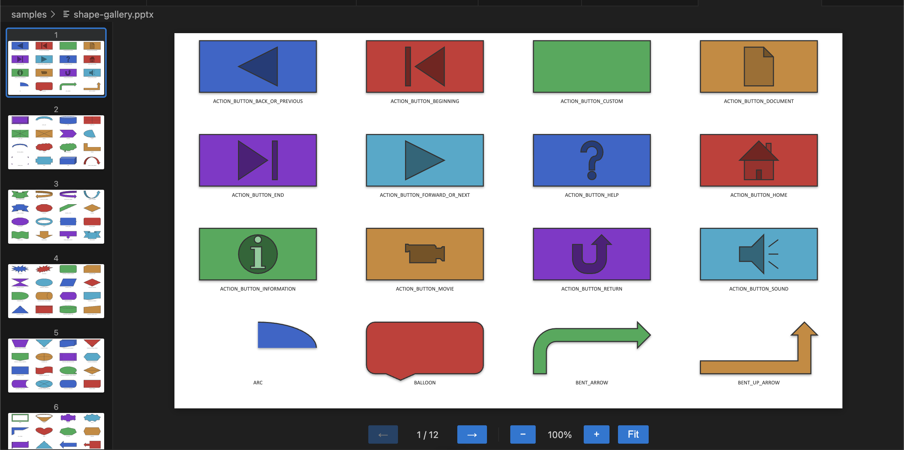

# PPTX Viewer

Open PowerPoint files directly inside VS Code and compatible editors (Cursor, Windsurf, etc.) — no PowerPoint, LibreOffice, or external converter required.

[日本語](README.ja.md) | [Marketplace](https://marketplace.visualstudio.com/items?itemName=astx-jp.vscode-pptx-viewer) | [GitHub](https://github.com/astx-jp/vscode-pptx-viewer)



## Use Cases

- **Check AI-generated slides instantly** — Preview `.pptx` files created by Claude Code, GPT, or other AI agents without leaving your editor
- **Quick-look decks without PowerPoint** — Skim through slide decks directly in VS Code / Cursor, no app switching needed
- **Local & private** — Everything runs locally. Your files are never sent to external servers

## Features

- Native PPTX rendering — parses PowerPoint XML directly, not a PDF/image conversion
- All OOXML presentation formats: `.pptx`, `.ppsx`, `.pptm`, `.ppsm`, `.potx`, `.potm`
- Slide navigation (next/prev, jump to slide)
- Thumbnail sidebar
- Bar chart rendering
- Keyboard-friendly, lightweight, zero external dependencies

## Usage

1. Open a PowerPoint file in your editor
2. The **PPTX Viewer** custom editor opens automatically

## Known Limitations

- Rendering is best-effort and may differ from PowerPoint
- Encrypted / password-protected files are not supported
- Macros in `.pptm` / `.ppsm` / `.potm` are ignored (view-only)

## Development

```bash
npm ci
npm run compile
```

Press `F5` to launch the Extension Development Host.

## Third-Party Data

Preset shape geometry definitions (`assets/ooxml/presetShapeDefinitions.xml`) are taken from the [ECMA-376 5th Edition](https://ecma-international.org/publications-and-standards/standards/ecma-376/) specification package (`OfficeOpenXML-DrawingMLGeometries.zip`). ECMA-376 is a publicly available international standard.

## License

Free to use, but not open source. See [LICENSE](LICENSE).

## Privacy & Security

- [Privacy Policy](PRIVACY.md)
- [Privacy Policy (日本語)](PRIVACY.ja.md)
- [Security Policy](SECURITY.md)
- [Security Policy (日本語)](SECURITY.ja.md)
